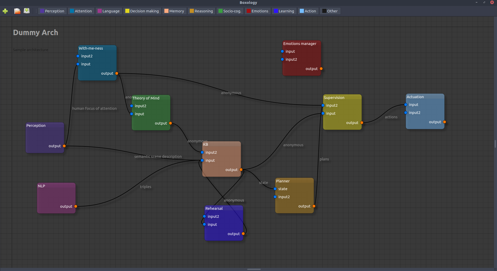

Boxology
========

**Work in progress!! Do not expect much yet!**

An editor to prototype cognitive architectures (with cognitive robotics in
mind!).

The UI has been build on top of
[qt5-node-editor](https://github.com/rochus/qt5-node-editor) by Nicolai Waniek.
Thanks to him!

Main features
-------------

- Convenient UI to create nodes for each cognitive processes;
- Connect them together;
- Label them with their main cognitive role;
- Save/load in a simple JSON format.
